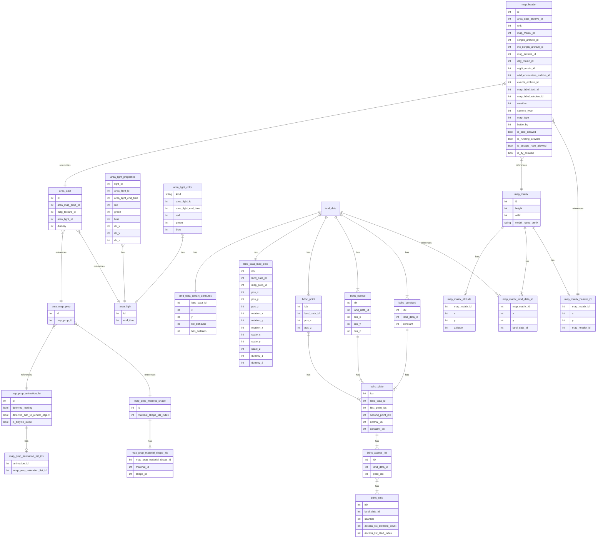

# `pokeplat_utils`

This is a CLI tool that can be used to interactively manipulate Pokémon Platinum data files.

## Installation

This is a Rust executable, which requires the Rust toolchain to be installed. You can install it the usual way,
using [`rustup`](https://rustup.rs/).

> [!NOTE]
> This crate requires the nightly toolchain to be installed. You can install it using the following command:
>
> ```bash
> rustup toolchain install nightly
> ```

After that, you can run or build the executable [as usual](https://doc.rust-lang.org/cargo/guide/working-on-an-existing-project.html),
using `cargo`:

```bash
cargo run --bin pokeplat_utils --release
```

```bash
cargo build --bin pokeplat_utils --release
```

If you built the executable, it will be located in the `target/release/` directory.

## Usage

The CLI integrates help for all commands. You can run the following command to see the help for the CLI:

```bash
pokeplat_utils --help
```

It is required to provide the paths to the resources files used by the game to the CLI. You can either:

- Clone the [`pret/pokeplatinum` repository](https://github.com/pret/pokeplatinum) and build the ROM. Then, use the
  `--pokeplatinum-repo-path` argument to point to the root of the repository.

  This is more involved as it requires building the ROM, but makes it easier to use the CLI as it will automatically
  find the required resource files for you.

- Provide the path to each resource file manually, using the arguments that are documented when running the CLI with
  `--help`.

The CLI is split into different subcommands. Please check the help for each subcommand to see the available options.

### SQL

The `sql` subcommand can be used to perform SQL-related operations on the game data files. This is useful if you want to
express complex queries to

You can export those files to a SQLite 3 database, which can be opened using any SQLite-compatible tool. The database
will contain all the data files supported by the tool:

```bash
pokeplat_utils --pokeplatinum-repo-path /path/to/pret/pokeplatinum sql export pokeplatinum.sqlite
```

This creates the database in the current directory, with the name `pokeplatinum.sqlite`.

You can also start an interactive REPL session to run SQL queries directly on the database:

```bash
pokeplat_utils --pokeplatinum-repo-path /path/to/pret/pokeplatinum sql repl
```

For reference, here's an entity-relationship diagram of the database generated by the tool. Please also refer to the
[file format specifications](https://github.com/pret/pokeplatinum/blob/main/docs/maps/file_format_specifications.md) of
the game for more information on the data files.

This diagram is here more to give an idea of the data structure than to be a complete reference.



As you can see, only map-related data is supported for now.
